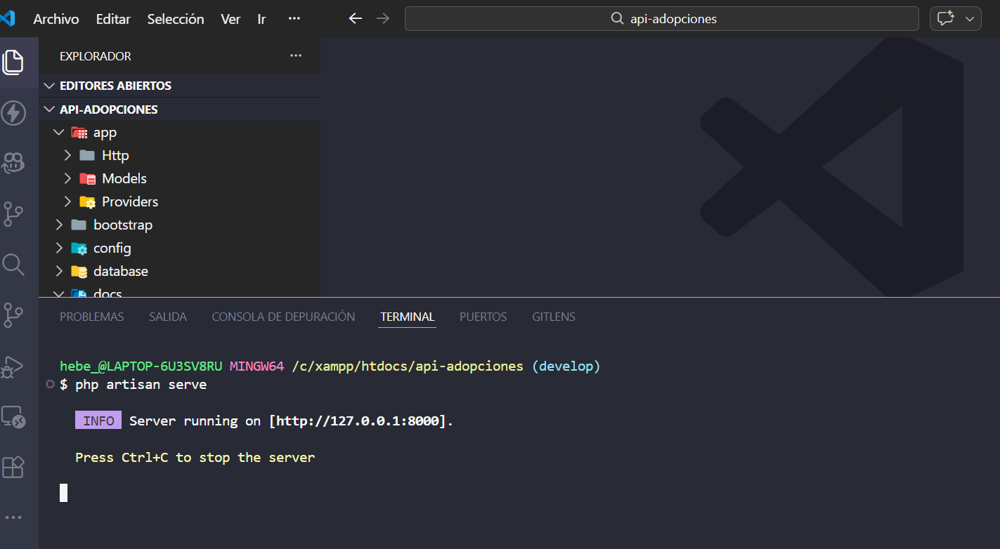
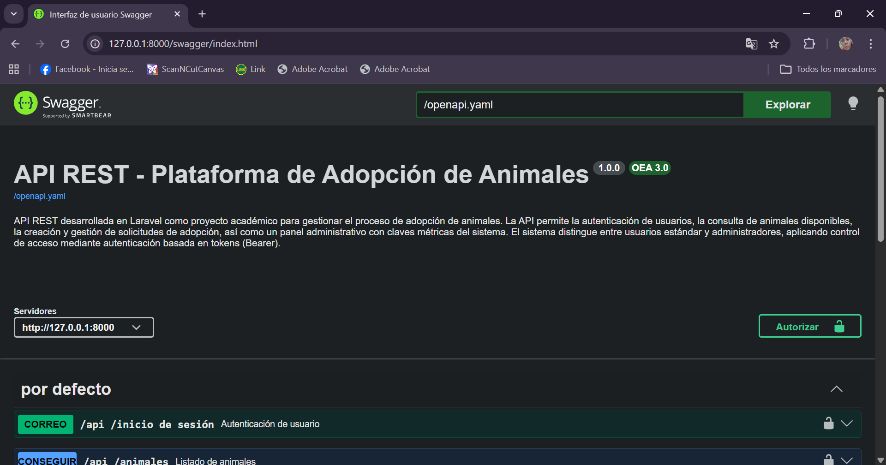
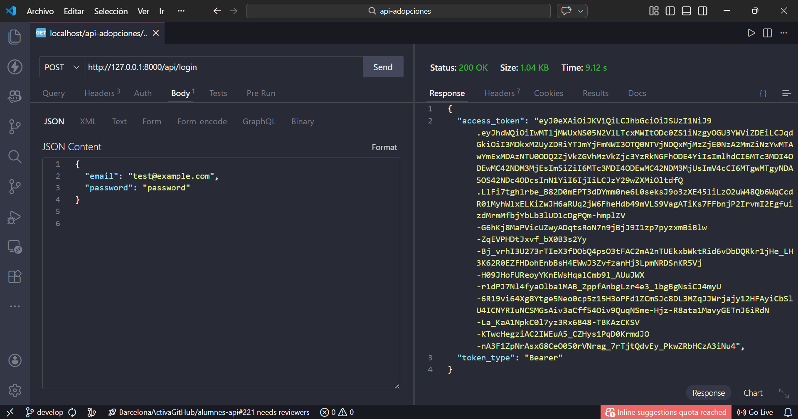
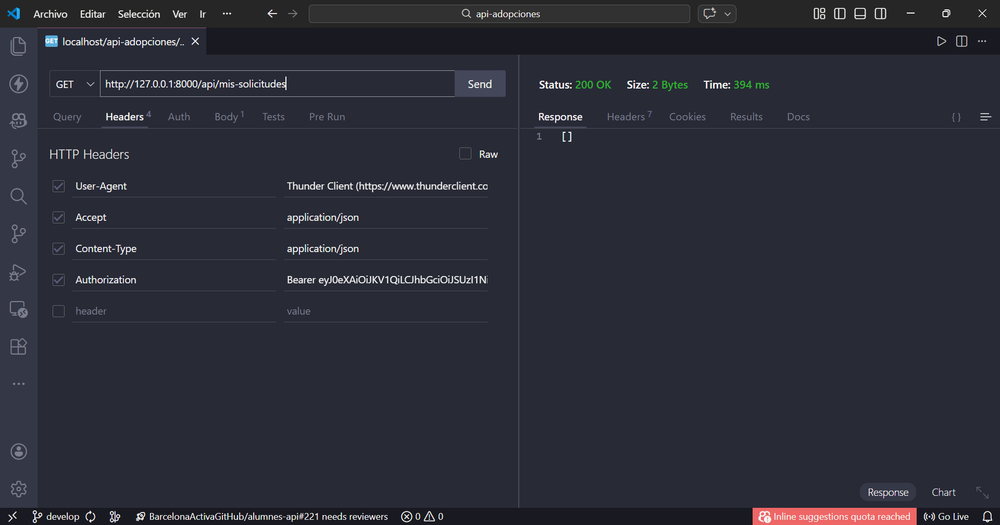
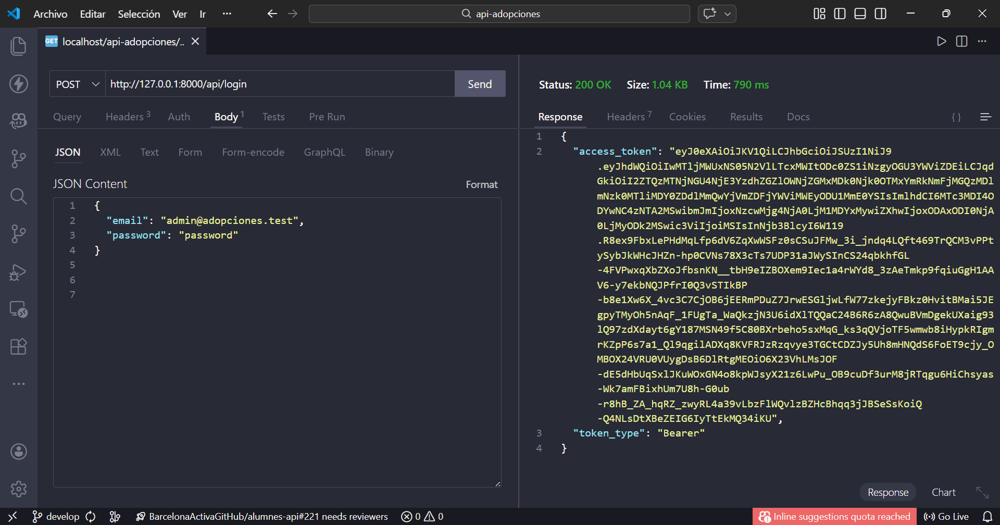
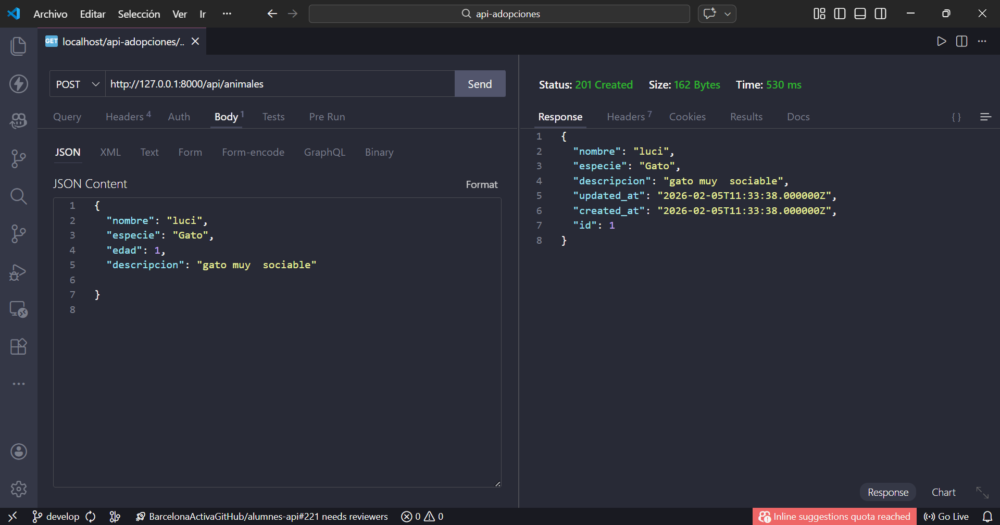
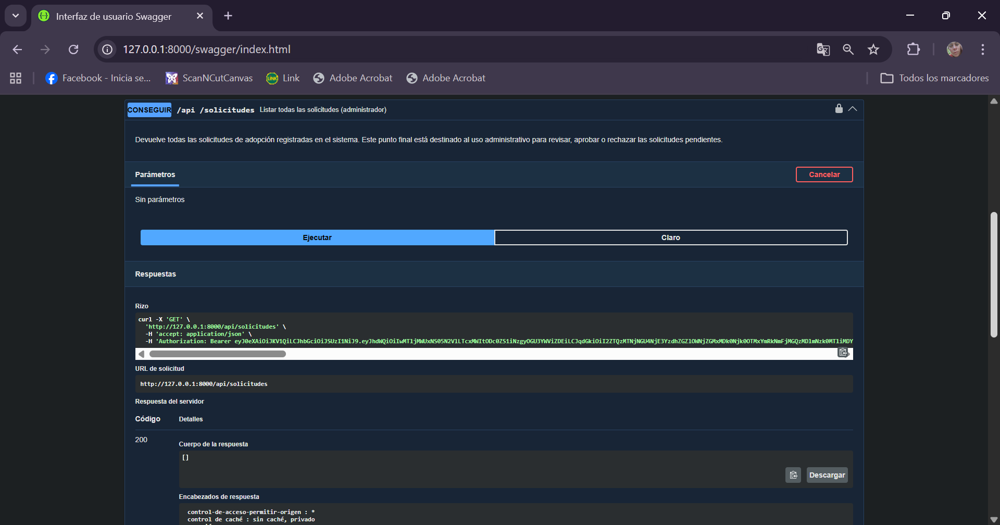

# API REST – Plataforma de Adopción de Animales

## 📌 Descripción general

Esta API REST ha sido desarrollada en Laravel el objetivo es gestionar el proceso de adopción de animales.  
El sistema permite a los usuarios autenticarse, consultar animales disponibles y crear solicitudes de adopción, mientras que los administradores pueden gestionar dichas solicitudes y visualizar métricas generales a través de un dashboard.

La API REST aplica control de acceso mediante autenticación basada en tokens (Bearer), diferenciando claramente entre usuarios estándar y administradores.

## Objetivo del proyecto

El objetivo principal es proporcionar una API que permita:

- Gestionar usuarios autenticados mediante tokens.
- Diferenciar permisos según el rol del usuario.
- Facilitar el flujo de adopción de animales de forma estructurada.
- Ofrecer un panel administrativo para la gestión del sistema.
- Documentar la API de manera clara mediante Swagger/OpenAPI.

## Tecnologías utilizadas

### Backend

- **Laravel** (Framework PHP)
- Arquitectura **API REST**
- Controladores, modelos y rutas siguiendo el patrón MVC

### Base de datos

- **Base de datos relacional** (configurable mediante el archivo `.env`)
- Uso de migraciones y modelos Eloquent

### Autenticación

- **Autenticación mediante token Bearer**
- Tokens enviados a través del encabezado `Authorization` en cada solicitud protegida

### Documentación

- **Swagger UI**
- Especificación **OpenAPI 3.0** en formato **YAML**

## Funcionamiento del sistema

### Autenticación mediante token Bearer

El acceso a los recursos protegidos de la API se realiza mediante autenticación por token:

1. El usuario se autentica en el sistema.
2. El servidor devuelve un token de acceso.
3. El cliente debe incluir dicho token en cada petición protegida usando el encabezado:

Authorization: Bearer {token}

Este mecanismo garantiza que solo los usuarios autenticados puedan acceder a determinadas funcionalidades de la API.

### Roles de usuario

El sistema contempla dos roles principales:

- **Usuario estándar**
  - Puede consultar animales disponibles.
  - Puede iniciar solicitudes de adopción.
  - Puede gestionar sus propias solicitudes.

- **Administrador**
  - Accede a un dashboard administrativo.
  - Puede gestionar animales, usuarios y solicitudes.
  - Supervisa el estado general del sistema.

La asignación de permisos se realiza en función del rol asociado al usuario autenticado.

### Flujo de adopción de animales

El proceso de adopción sigue un flujo básico:

1. El usuario autenticado consulta el listado de animales disponibles.
2. Selecciona un animal y envía una solicitud de adopción.
3. La solicitud queda registrada en el sistema.
4. El administrador revisa las solicitudes desde el panel administrativo.
5. El estado de la solicitud puede ser gestionado por el administrador.

Este flujo permite simular un proceso real de adopción de forma sencilla y controlada.

### Dashboard administrativo

El sistema incluye un **dashboard administrativo**, accesible únicamente para usuarios con rol de administrador.  
Desde este panel es posible:

- Visualizar información general del sistema.
- Gestionar animales registrados.
- Revisar y administrar solicitudes de adopción.
- Supervisar usuarios y su actividad.

## Instalación y ejecución en entorno local

### Requisitos previos

- PHP (versión compatible con Laravel)
- Composer
- Servidor de base de datos (por ejemplo, MySQL)
- Servidor web o servidor embebido de Laravel

### Pasos de instalación

1. Clonar el repositorio del proyecto.
2. Instalar las dependencias:

```bash
composer install
```

3.Copiar el archivo de entorno:

```bash
cp .env.example .env
```

4.Configurar las credenciales de la base de datos en el archivo `.env`.

5.Generar la clave de la aplicación:

```bash
php artisan key:generate
```

6.Ejecutar las migraciones:

```bash
php artisan migrate
```

7.Iniciar el servidor de desarrollo:

```bash
php artisan serve
```

El proyecto estará disponible por defecto en:

<http://127.0.0.1:8000>

## Documentación de la API

La API está documentada utilizando Swagger UI, lo que permite explorar y probar los endpoints disponibles de forma interactiva.

URL de Swagger UI:

<http://127.0.0.1:8000/swagger/index.html>

La documentación se genera a partir de un archivo OpenAPI 3.0 en formato YAML, manteniendo coherencia con la implementación real de la API.

## Pruebas y validación del sistema

Con el objetivo de probar el funcionamiento de la API REST, se realizaron diversas pruebas funcionales utilizando **Thunder Client** como herramienta de cliente HTTP y **Swagger UI** como interfaz de documentación basada en OpenAPI. A continuación, se detallan las principales pruebas realizadas.

## Puesta en marcha del servidor

### Servidor Laravel en ejecución



Se inicia el servidor de desarrollo de Laravel mediante el comando `php artisan serve`, quedando la API accesible en la dirección `http://127.0.0.1:8000`. Esta prueba confirma que el entorno local está correctamente configurado y operativo

### Documentación de la API con Swagger UI

#### Interfaz Swagger UI



La documentación de la API se encuentra disponible a través de Swagger UI, accesible en la URL `http://127.0.0.1:8000/swagger/index.html`.  
La interfaz muestra la información general del proyecto, la versión de la API y el listado de endpoints documentados según la especificación OpenAPI 3.0 en formato YAML.

### Autenticación de usuario estándar

#### Inicio de sesión de usuario estándar



Se realiza el inicio de sesión de un usuario estándar mediante el endpoint de autenticación. Como respuesta, el sistema devuelve un token de acceso junto con el tipo `Bearer`, el cual será utilizado para acceder a los endpoints protegidos.

### Acceso a recursos protegidos con token Bearer

#### Acceso a solicitudes del usuario autenticado



Utilizando el token Bearer en la cabecera `Authorization`, el usuario autenticado accede correctamente a un endpoint protegido que devuelve sus propias solicitudes. Esta prueba valida el uso de Laravel Passport para la autenticación basada en tokens.

### Autenticación de usuario administrador

#### Inicio de sesión de administrador



Se realiza el inicio de sesión con un usuario con rol de administrador. El sistema devuelve un token válido que permite el acceso a funcionalidades administrativas restringidas.

### Creación de animales por parte del administrador

#### Creación de un animal (usuario administrador)



En esta prueba se valida la funcionalidad de creación de animales, accesible únicamente para usuarios con rol de administrador.  
Mediante una petición `POST` al endpoint correspondiente, el administrador envía los datos del animal en formato JSON. El sistema responde con un código HTTP `201 Created`, confirmando que el recurso ha sido creado correctamente y almacenado en la base de datos.

### Acceso al dashboard administrativo

#### Acceso al dashboard administrativo (métricas del sistema)


El administrador accede a un endpoint exclusivo que devuelve métricas del sistema, como animales disponibles, animales adoptados y solicitudes pendientes. Esta prueba confirma la correcta aplicación del control de acceso basado en roles.

### Protección de endpoints mediante autenticación

#### Uso de token Bearer en endpoint protegido


Se observa el uso del encabezado `Authorization: Bearer` en Thunder Client para acceder a endpoints protegidos. Sin un token válido, el acceso a estos recursos estaría denegado.

#### Autorización en Swagger UI


Swagger UI permite autorizar peticiones mediante la introducción del token Bearer, facilitando la prueba de endpoints protegidos directamente desde la documentación.

#### Ejecución de endpoint de solicitudes (administrador)



Desde Swagger UI se ejecuta un endpoint administrativo que devuelve la lista completa de solicitudes de adopción. La respuesta correcta con código HTTP 200 confirma la coherencia entre la implementación de la API y su documentación.
